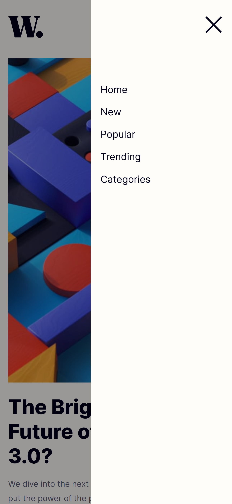
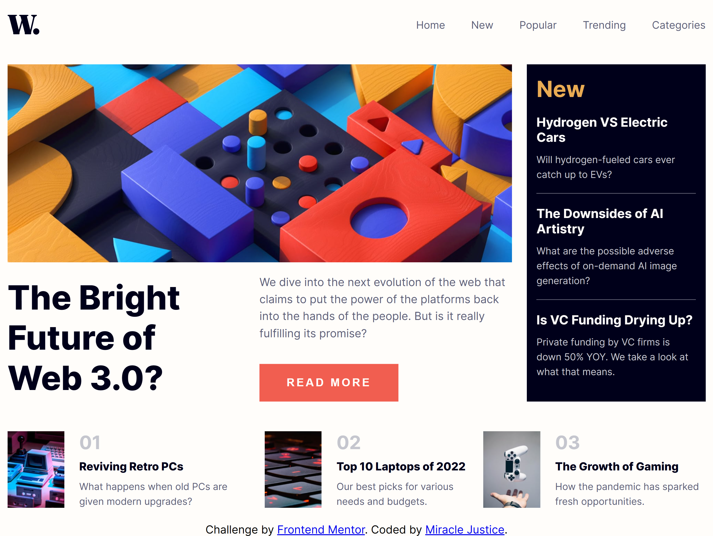

# Frontend Mentor - News homepage solution

This is my solution to the [News homepage challenge on Frontend Mentor](https://www.frontendmentor.io/challenges/news-homepage-H6SWTa1MFl). Frontend Mentor challenges help you improve your coding skills by building realistic projects. 

### Overview

### Links

- Solution URL: [Click to view Solution](https://www.frontendmentor.io/solutions/responsive-news-homepage-Izk-ZW3RlR)
- Live Site URL: [Click to view Live Site](https://coded-by-mj.github.io/Front-end-Mentor-Challenge8/)

## My process

### Built with
- Semantic HTML5 markup
- CSS custom properties
- SCSS
- Javascript
- Mobile First Workflow

## Author

- Frontend Mentor - [@Coded-by-MJ](https://www.frontendmentor.io/profile/Coded-by-MJ)
- Twitter - [@MiracleJustice_](https://twitter.com/MiracleJustice_)
